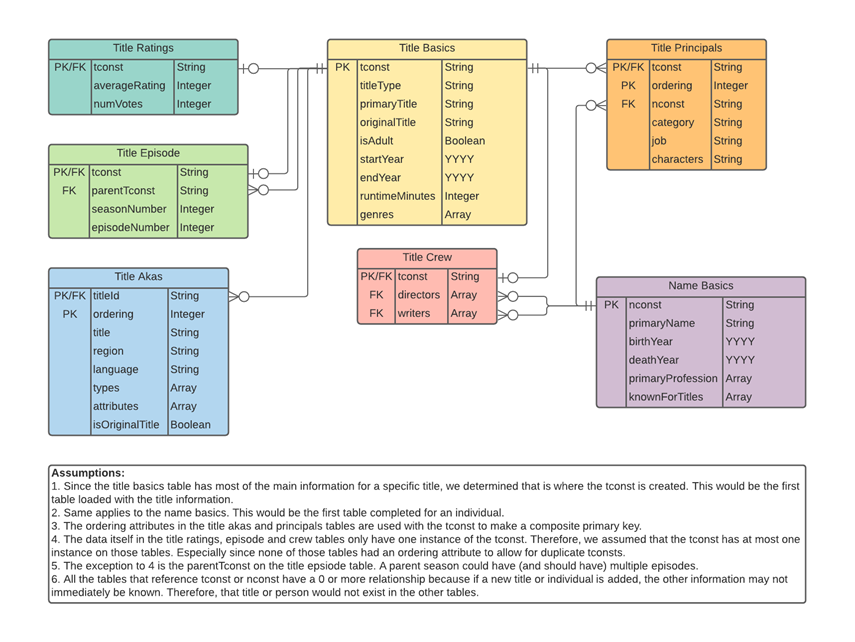
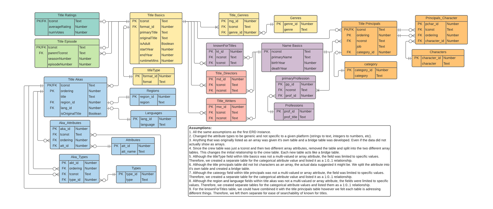
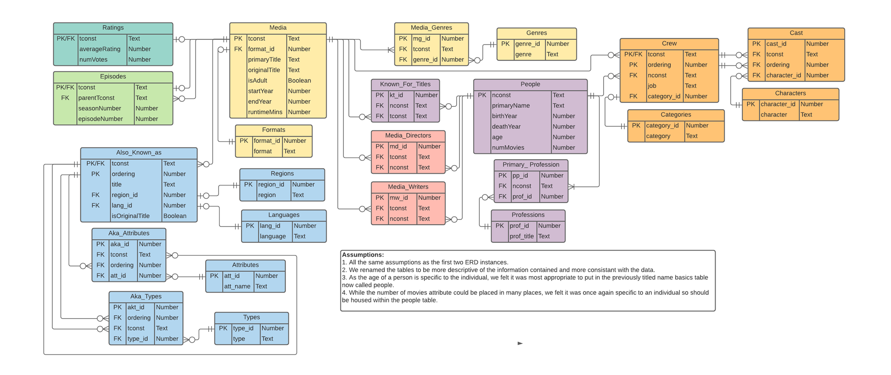

## Overview

We've decided to work with SQLite for this practicum. As such, to work with these files you will need SQLite installed on your machine. The data we are using is provided by IMDB at https://datasets.imdbws.com/

The code and supporting files for this practicum can also be viewed at [GitHub](https://github.com/eldss-classwork/databases-practicum-2).

## Task 2

Read the data description and inspect the files

### Task 2A

Create a data model in the form of an ERD in Crow's Foot notation using a tool of your choice (e.g., LucidChart, TOAD, MySQL Workbench, etc.) and embed an image of the model in your notebook. Your ERD should be a normalized model and not a direct representation of the data in the files.Later, when you load the data you will map the data from the files to the columns in the tables.

Although task 2A states normalization, per the teams channel, the first diagram should not be normalized and just a representation of the tables in ERD format.

Lucidchart link: https://app.lucidchart.com/invitations/accept/f758a126-c1a0-48b8-b425-11db4b9ac894



### Task 2B

Add junction/association tables to normalize many-to-many relationships, normalize multi-valued attributes, and create lookup tables for categorical attribute values. Embed an updated image of the model in your notebook.

Lucidchart link: https://app.lucidchart.com/invitations/accept/f758a126-c1a0-48b8-b425-11db4b9ac894



### Task 2C

Add two new attributes (columns) to the appropriate tables: one for the age of a person and one for the number of movies a person has appeared in. Embed an updated image of the model in your notebook. Leave those columns empty for now. They will be filled in later.

Lucidchart link: https://app.lucidchart.com/invitations/accept/f758a126-c1a0-48b8-b425-11db4b9ac894



### Task 2D

Ensure that the relational model is in at least BCNF; if a table should not be or cannot be in BCNF, then justify why not and provide a reason. Remember: no multi-valued attributes.

Please see the assumptions on each ERD image as to the normalization process followed.

## Setup

The first thing we need to do is download and process the data files we need for the practicum. These will be downloaded from IMDB and processed into smaller sample files for ease of working with in the rest of the notebook. In normal circumstances we would do this with a faster language that is better suited for file manipulation in a separate script. For the purposes of this assignment we have included the entire script below as a single chunk. If you are running this yourself and want to either download fresh copies of the data from IMDB, or create and/or use a sample set of existing copies, then you should change the `download` and/or `sampleSet` variables to `TRUE` below. But be warned this will take a VERY long time depending on your computer. We have included the created sample set files with our submission so that you do not have to wait for this unless you want to.

Additionally, since the loading of the full datasets and creation of the database is also a long process (with limitation depending on hardware or OS), the variables `createFrames` and `createDB` should be used if you wish to rebuild the database. Our current database file is over 4GB and therefore could not be provided via CANVAS. If you wish to access it, please download from the following link.

Zipped .db file: https://drive.google.com/file/d/1f4cILKLngWHY4np12zEzWMVx2MDACCAl/view?usp=sharing

Our final knitted document uses this database, skipping the downloading, processing and data loading steps. This is due to the incredibly large CPU and memory demand required, that we simply cannot provide ourselves. However, we have left all the code in place that we used to initially build the database so you can inspect it. Feel free to change the variables below in order to actually run that code as well. But be aware that it will likely take a very long time and may cause your computer to crash if it does not have enough resources to handle the workload.

```{r, results='hide', message=FALSE}
library(data.table)
library(hash)
library(readr)
library(tidyr)
library(dplyr)
library(tibble)
library(stringr)

# False by default. Change to true if you need these files or want new versions.
# This may necessitate filtering the datasets as well.
# Caution: This will take a long time and may overwhelm your computer!!! 
download <- FALSE
createSampleSet <- FALSE
useSampleSet <- FALSE
createFrames <- FALSE
createDB <- FALSE
# Print head should be set to true if you wish to print the top 5 rows of 
# each database table to ensure the data exists inside the DB.
# Due to the size of the database and the R connection, this may take several minutes
printHead <- TRUE

# File constants
dataDir <- "./data/"
sampleDataDir <- "./sample-data/"
url <- "https://datasets.imdbws.com/"
nameBasics <- "name.basics"
titleBasics <- "title.basics"
titleAkas <- "title.akas"
titleCrew <- "title.crew"
titleEpisode <- "title.episode"
titlePrincipals <- "title.principals"
titleRatings <- "title.ratings"
gz <- ".tsv.gz"
sampleTsv <- ".sample.tsv"

# ========== Functions to process sample data set ==========
# This section would normally be in a different script so is kept as a single
# chunk here.

downloadData <- function() {
  #' Downloads all needed data files from IMDB.
  filenames <- c(nameBasics, titleBasics, titleAkas, titleCrew,
                 titleEpisode, titlePrincipals, titleRatings)
  for (name in filenames) {
    website <- paste(url, name, gz, sep="")
    destination <- paste(dataDir, name, gz, sep="")
    download.file(website, destination)
  }
}

createDataframe <- function(filename, rows=-1) {
  #' Creates a dataframe out of a tsv file from IMDB. Can specify a row limit
  #' with rows, but defaults to the whole file
  frame <- fread(filename, na.strings = c("NA","\\N"), encoding = "UTF-8", data.table = FALSE, 
        quote="", showProgress = FALSE, nrows = rows)  # fread is a faster alternative to read.tsv
  frame
}

createTitleIdSet <- function(episodeRows, nameRows) {
  #' Creates a set of title ids from the tconst values in the episode and 
  #' name tsv files. These are used due to create a representative dataset
  #' that has both episodes and actors that appear in more than one included
  #' movie (that is not a show).
  epPaths <- getFullAndSamplePaths(titleEpisode)
  namePaths <- getFullAndSamplePaths(nameBasics)
  
  df.eps <- createDataframe(epPaths$full, episodeRows)
  df.names <- createDataframe(namePaths$full, nameRows)
  
  # Separate knownForTitles
  kfTitles <- drop_na(df.names["knownForTitles"]) %>%
    mutate(knownForTitles = strsplit(as.character(knownForTitles), ",")) %>%
    unnest(knownForTitles)
  
  # Combine all titles into a set
  allTitles <- unique(
    union_all(
      as.character(df.eps$tconst),
      as.character(df.eps$parentTconst),
      kfTitles$knownForTitles
    )
  )
  titleSet = hash(allTitles, 1:length(allTitles))  # values don't matter for the set
  
  titleSet
}

createNamesIdSet <- function(princNames, dirNames, writeNames) {
  # Gather all unique name IDs into single series
  allNames <- unique(
    union_all(
      princNames,
      dirNames,
      writeNames
    )
  )
  # Add them to a hash
  nameSet = hash(allNames, 1:length(allNames))  # values don't matter for the set
  
  nameSet
}

writeEpisodeSample <- function(numRows) {
  #' Writes sample data from the episodes tsv. This can be processed faster
  #' than others because we simply select a number of rows to included from
  #' the top.
  paths <- getOldAndNewPaths(titleEpisode)
  df <- createDataframe(paths$full, numRows)
  write_tsv(df, paths$sample)
}

writeFilteredTsv <- function(filename, filterSet, colname = "tconst") {
  #' Writes an existing dataframe after filtering it on tconst
  paths <- getFullAndSamplePaths(filename)
  df <- createDataframe(paths$full)
  
  # This may take several minutes...
  if (colname == "tconst") {
    df <- filter(df, has.key(tconst, filterSet))  
  } else if (colname == "titleId") {
    df <- filter(df, has.key(titleId, filterSet))
  } else if (colname == "nconst") {
    df <- filter(df, has.key(nconst, filterSet)) 
  } # Don't filter if colname different
  
  # Write out the data
  write_tsv(df, paths$sample)
  
  # Return the filtered dataframe in case it needs further processing
  df
}

flattenAndWriteCrewToDirectors <- function(crewDataframe) {
  #' Takes the crew data and flattens the directors column so all values are
  #' on their own line and then writes it to disk. Will be used later.
  # Separate directors
  df.directors <- crewDataframe[c("tconst", "directors")] %>%
    mutate(directors = strsplit(as.character(directors), ",")) %>%
    unnest(directors)
  
  # Remove titles with no director listed
  df.directors <- drop_na(df.directors)
  
  # Write
  if(useSampleSet){
    outfile <- paste(sampleDataDir, "title.directors", sampleTsv, sep="")
    write_tsv(df.directors, outfile)
  }
  
  df.directors
}

flattenAndWriteCrewToWriters <- function(crewDataframe) {
  #' Takes the crew data and flattens the writers column so all values are
  #' on their own line and then writes it to disk. Will be used later.
  # Separate writers
  df.writers <- crewDataframe[c("tconst", "writers")] %>%
    mutate(writers = strsplit(as.character(writers), ",")) %>%
    unnest(writers)
  
  # Remove titles with no director listed
  df.writers <- drop_na(df.writers)
  
  # Write
  if(useSampleSet){
    outfile <- paste(sampleDataDir, "title.writers", sampleTsv, sep="")
    write_tsv(df.writers, outfile)
  }
  
  df.writers
}

getFullAndSamplePaths <- function(filename) {
  #' Returns the path to the original data file and the sample data file in
  #' a list.
  full <- paste(dataDir, filename, gz, sep="")
  sample <- paste(sampleDataDir, filename, sampleTsv, sep="")
  list("full" = full, "sample" = sample)
}

# ========== Actual processing for sample data ==========

if (download) {
  if (!dir.exists(dataDir)) {
    dir.create(dataDir)
  }
  downloadData()
}

if (createSampleSet) {
  if (!dir.exists(sampleDataDir)) {
    dir.create(sampleDataDir)  
  }
  # Constants for selecting titles to include
  numEpRows <- 500
  numNameRows <- 50
  
  # Get titles to include
  titleIdSet <- createTitleIdSet(numEpRows, numNameRows)
  
  # Process files that we do not need to extract name ids from
  writeEpisodeSample(numEpRows)
  writeFilteredTsv(titleBasics, titleIdSet)
  writeFilteredTsv(titleAkas, titleIdSet, "titleId")
  writeFilteredTsv(titleRatings, titleIdSet)
  
  # Process files that do need to extract name ids
  df <- writeFilteredTsv(titlePrincipals, titleIdSet)
  princ.names <- as.character(df$nconst)
  df <- writeFilteredTsv(titleCrew, titleIdSet)
  dirs.names <- flattenAndWriteCrewToDirectors(df)
  write.names <- flattenAndWriteCrewToWriters(df)

  nameIdSet <- createNamesIdSet(
    princ.names,
    dirs.names$directors,
    write.names$writers
  )

  # Finally, process the names table
  writeFilteredTsv(nameBasics, nameIdSet, "nconst")
}
```

Before working with the data we need to create a place to store it. This section will set up a SQLite database and any constants needed later. Because of the time it takes to build the full database, we use a different name for the sample data set so that we do not overwrite the full one.

```{r}
library(RSQLite)

# Setup SQLite database
if (useSampleSet) {
  DB_NAME <- "imdb-sample-data.db"
} else {
  DB_NAME <- "imdb-data.db"
}
conn <- dbConnect(RSQLite::SQLite(), DB_NAME)
```

## Task 3

Create and then run CREATE TABLE statements to build the schema. These statements must run from within your notebook and not from a separate script. Ensure proper referential integrity.

### Database Schema

The following chunk creates all the necessary tables in our database based on the schema presented earlier.

Please note: We have created the full schema but not all of the tables will have data due to hardware/OS limitations.

```{r, results='hide'}
if (createDB) {
  # First we need to remove any existing data,
  # for example, if this has been run before.
  drop_table <- function(table_name) {
    paste("DROP TABLE IF EXISTS ", table_name, ";", sep="")
  }
  
  dbExecute(conn,"DROP VIEW IF EXISTS actors;")
  
  # Saving rows affected to a var prevents output
  dbExecute(conn, "PRAGMA foreign_keys = OFF;") # Avoid FK checks
  curr_tables <- dbListTables(conn)
  for (table in curr_tables) {
    dbExecute(conn, drop_table(table))
  }
  dbExecute(conn, "PRAGMA foreign_keys = ON;")
  
  # Now we can create the tables
  build_table <- function(table_def) {
    CREATE <- "CREATE TABLE IF NOT EXISTS"
    paste(CREATE, table_def)
  }
  
  # Build table definition list
  tables <- c(
    build_table(
      "Formats (
        format_id INTEGER PRIMARY KEY,
        format TEXT NOT NULL
      );"
    ),
    build_table(
      "Media (
        tconst TEXT PRIMARY KEY,
        format_id INTEGER NOT NULL,
        primaryTitle TEXT,
        originalTitle TEXT,
        isAdult INTEGER, -- 0=false, else true
        startYear INTEGER,
        endYear INTEGER,
        runtimeMinutes INTEGER,
        FOREIGN KEY (format_id) REFERENCES Formats(format_id)
      );"
    ),
    build_table(
      "Ratings (
        tconst TEXT PRIMARY KEY,
        averageRating REAL,
        numVotes INTEGER,
        FOREIGN KEY (tconst) REFERENCES Media(tconst)
      );"
    ),
    build_table(
      "Episodes (
        -- Bad data in this table requires us to overwrite it later.
        -- It is kept here mostly for documentation to show the full
        -- schema.
        tconst TEXT PRIMARY KEY,
        parentTconst TEXT NOT NULL,
        seasonNumber INTEGER,
        episodeNumber INTEGER,
        FOREIGN KEY (tconst) REFERENCES Media(tconst),
        FOREIGN KEY (parentTconst) REFERENCES Media(tconst)
      );"
    ),
    build_table(
      "Genres (
        genre_id INTEGER PRIMARY KEY,
        genre TEXT NOT NULL
      );"
    ),
    build_table(
      "Media_Genres (
        mg_id INTEGER PRIMARY KEY,
        tconst TEXT NOT NULL,
        genre_id INTEGER NOT NULL,
        FOREIGN KEY (tconst) REFERENCES Media(tconst),
        FOREIGN KEY (genre_id) REFERENCES Genres(genre_id),
        CONSTRAINT unique_mg_tc_gid UNIQUE (tconst, genre_id)
      );"
    ),
    build_table(
      "People (
        nconst TEXT PRIMARY KEY,
        primaryName TEXT,
        birthYear INTEGER,
        deathYear INTEGER,
        age INTEGER,
        numMovies INTEGER
      );"
    ),
    build_table(
      "Known_For_Titles (
        -- Bad data in this table requires us to overwrite it later.
        -- It is kept here mostly for documentation to show the full
        -- schema.
        kt_id INTEGER PRIMARY KEY,
        nconst TEXT NOT NULL,
        tconst TEXT NOT NULL,
        FOREIGN KEY (tconst) REFERENCES Media(tconst),
        FOREIGN KEY (nconst) REFERENCES People(nconst),
        CONSTRAINT unique_kft_nc_tc UNIQUE (nconst, tconst)
      );"
    ),
    build_table(
      "Professions (
        prof_id INTEGER PRIMARY KEY,
        prof_title TEXT NOT NULL
      );"
    ),
    build_table(
      "Primary_Profession (
        pp_id INTEGER PRIMARY KEY,
        nconst TEXT NOT NULL,
        prof_id INTEGER NOT NULL,
        FOREIGN KEY (nconst) REFERENCES People(nconst),
        FOREIGN KEY (prof_id) REFERENCES Professions(prof_id),
        CONSTRAINT unique_pp_nc_pid UNIQUE (nconst, prof_id)
      );"
    ),
    build_table(
      "Categories (
        category_id INTEGER PRIMARY KEY,
        category TEXT NOT NULL
      );"
    ),
    build_table(
      "Crew (
        -- Bad data in this table requires us to overwrite it later.
        -- It is kept here mostly for documentation to show the full
        -- schema.
        tconst TEXT NOT NULL,
        ordering INTEGER NOT NULL,
        nconst TEXT NOT NULL,
        category_id INTEGER NOT NULL,
        job TEXT,
        characters TEXT,
        PRIMARY KEY (tconst, ordering),
        FOREIGN KEY (tconst) REFERENCES Media(tconst),
        FOREIGN KEY (nconst) REFERENCES People(nconst),
        FOREIGN KEY (category_id) REFERENCES Categories(category_id)
      );"
    ),
    build_table(
      "Characters (
        character_id INTEGER PRIMARY KEY,
        character TEXT NOT NULL
      );"
    ),
    build_table(
      "Cast (
        cast_id INTEGER PRIMARY KEY,
        tconst TEXT NOT NULL,
        ordering INTEGER NOT NULL,
        character_id INTEGER NOT NULL,
        -- Media table PK tconst has ref. integrity through Crew Table
        FOREIGN KEY (tconst, ordering) REFERENCES Crew(tconst, ordering),
        FOREIGN KEY (character_id) REFERENCES Characters(character_id),
        CONSTRAINT unique_crew_tc_ord_tid UNIQUE (tconst, ordering, character_id)
      );"
    ),
    build_table(
      "Media_Directors (
        md_id INTEGER PRIMARY KEY,
        tconst TEXT NOT NULL,
        nconst TEXT NOT NULL,
        FOREIGN KEY (tconst) REFERENCES Media(tconst),
        FOREIGN KEY (nconst) REFERENCES People(nconst),
        CONSTRAINT unique_md_nc_tc UNIQUE (nconst, tconst)
      );"
    ),
    build_table(
      "Media_Writers (
        mw_id INTEGER PRIMARY KEY,
        tconst TEXT NOT NULL,
        nconst TEXT NOT NULL,
        FOREIGN KEY (tconst) REFERENCES Media(tconst),
        FOREIGN KEY (nconst) REFERENCES People(nconst),
        CONSTRAINT unique_mw_nc_tc UNIQUE (nconst, tconst)
      );"
    ),
    build_table(
      "Regions (
        region_id INTEGER PRIMARY KEY,
        region TEXT NOT NULL
      );"
    ),
    build_table(
      "Languages (
        lang_id INTEGER PRIMARY KEY,
        language TEXT NOT NULL
      );"
    ),
    build_table(
      "Also_Known_As (
        tconst TEXT NOT NULL,
        ordering INTEGER NOT NULL,
        title TEXT,
        region_id INTEGER,
        lang_id INTEGER,
        isOriginalTitle INTEGER, -- 0=false, else true
        PRIMARY KEY (tconst, ordering),
        FOREIGN KEY (tconst) REFERENCES Media(tconst),
        FOREIGN KEY (region_id) REFERENCES Regions(region_id),
        FOREIGN KEY (lang_id) REFERENCES Languages(lang_id)
      );"
    ),
    build_table(
      "Types (
        type_id INTEGER PRIMARY KEY,
        type TEXT NOT NULL
      );"
    ),
    build_table(
      "Aka_Types (
        akt_id INTEGER PRIMARY KEY,
        tconst TEXT NOT NULL,
        ordering INTEGER NOT NULL,
        type_id INTEGER NOT NULL,
        -- Media table PK tconst has ref. integrity through AKA Table
        FOREIGN KEY (tconst, ordering) REFERENCES Also_Known_As(tconst, ordering),
        FOREIGN KEY (type_id) REFERENCES Types(type_id),
        CONSTRAINT unique_akat_tc_ord_tid UNIQUE (tconst, ordering, type_id)
      );"
    ),
    build_table(
      "Attributes (
        att_id INTEGER PRIMARY KEY,
        att_name TEXT NOT NULL
      );"
    ),
    build_table(
      "Aka_Attributes (
        aka_id INTEGER PRIMARY KEY,
        tconst TEXT NOT NULL,
        ordering INTEGER NOT NULL,
        att_id INTEGER NOT NULL,
        -- Media table PK tconst has ref. integrity through AKA Table
        FOREIGN KEY (tconst, ordering) REFERENCES Also_Known_As(tconst, ordering),
        FOREIGN KEY (att_id) REFERENCES Attributes(att_id),
        CONSTRAINT unique_akaatt_tc_ord_aid UNIQUE (tconst, ordering, att_id)
      );"
    )
  )
  
  # Actually create the tables
  for (table_stmt in tables) {
    dbExecute(conn, table_stmt)
  }
}
```

## Task 4

Load the data from the downloaded data files into the tables. Properly parse the foreign keys and attributes and ensure that the data is in the right tables in the right form and that referential integrity is ensured. This will require parsing code in your chosen programming language; pay attention to parsing empty fields and fields containing various delimiters or codes to indicate missing values, e.g., \\N. 

You should create a subset of each dataset for testing (as the data sets are very large and take significant time to load). 

### Reading Data Locally

Next we need to convert the datasets into dataframes for manipulation and loading to the database. 

We'll set up some constants first. These will determine whether we are using the full data files or the subset.

```{r}
if(useSampleSet){
  dir <- sampleDataDir
  ext <- sampleTsv
} else {
  dir <- dataDir
  ext <- gz
}
names <- paste(dir, nameBasics, ext, sep="")
titles <- paste(dir, titleBasics, ext, sep="")
akas <- paste(dir, titleAkas, ext, sep="")
episodes <- paste(dir, titleEpisode, ext, sep="")
principals <- paste(dir, titlePrincipals, ext, sep="")
ratings <- paste(dir, titleRatings, ext, sep="")
crew <- paste(dir, titleCrew, ext, sep="")
directors <- paste(dir, "title.directors", ext, sep="")
writers <- paste(dir, "title.writers", ext, sep="")
```

#### Titles

The number of titles we choose to include will determine the amount of data read in from other files. Therefore we will get this data first.

```{r, message=FALSE}
if (createFrames) {
  df.titles <- createDataframe(titles)
  head(df.titles)
}
```

#### AKAs

```{r, message=FALSE}
if (createFrames) {
  df.akas <- createDataframe(akas)
  head(df.akas)
}
```

#### Episodes

```{r, message=FALSE}
if (createFrames) {
  df.eps <- createDataframe(episodes)
  head(df.eps)
}
```

#### Ratings

```{r, message=FALSE}
if (createFrames) {
  df.ratings <- createDataframe(ratings)
  head(df.ratings)
}
```

#### Principles

```{r, message=FALSE}
if (createFrames) {
  df.princ <- createDataframe(principals)
  head(df.princ)
}
```

#### Crew

In creating the sample set the crew data was split into separate sets for directors and writers.
If the sample set is not being used, the table needs to be split

```{r, message=FALSE}
if (createFrames) {
  if(useSampleSet){
    df.dirs <- createDataframe(directors)
    print(head(df.dirs))
    df.writers <- createDataframe(writers)
    print(head(df.writers))
  } else {
    df.crew <- createDataframe(crew)
    df.dirs <- flattenAndWriteCrewToDirectors(df.crew)
    print(head(df.dirs))
    df.writers <- flattenAndWriteCrewToWriters(df.crew)
    print(head(df.writers))
  }
}
```

#### Names/People

```{r, message=FALSE}
if (createFrames) {
  df.names <- createDataframe(names)
  head(df.names)
}
```

### Loading Data to Database

This section will take the data extracted previously, manipulate it as needed, and then add it to our database as needed.

### "Formats" table

```{r}
if(createDB){
  loadFormats <- function(overwrite){
    # Grab the needed columns from the current dataframe
    types <- df.titles[,c(0,2)]
    # Since this is a categorical table, grab unique values
    format <- unique(types)
    # Create a new dataframe with unique values
    df_tt <- data.frame(format)
    # Remove titles with no format listed
    df_tt <- drop_na(df_tt)
    # Assign unique ids to the unique values - only works on initial loading of data
    df_tt <- tibble::rowid_to_column(df_tt, "format_id")
    colnames(df_tt) <- c("format_id", "format")
    # Transfer the new dataframe into the database table
    # While append is the preferred method because we want to maintain the 
    # referential integrity relationships during table creation, we allowed 
    # for an overwrite option in case there were issues that needed to be 
    # addressed after loading
    if(overwrite){
      dbWriteTable(conn,"Formats",df_tt, overwrite=TRUE)
    } else {
      dbWriteTable(conn,"Formats",df_tt, append=TRUE)
    }
    return(df_tt)
  }
}
```

### "Media" table

```{r}
if(createDB){
  loadMedia <- function(df_tt, overwrite){
    # Grab the needed columns from the current dataframe
    df_media <- df.titles[,-c(0,9)]
    # Add a column for the FK id
    df_media <- add_column(df_media, format_id = NA, .after = 1)
    
    # Get a list of the categories available
    types <- df_tt[,c(0,2)]
    # For each category, assign the FK id
    for(term in types) {
      search1 <- df_tt$format == term
      # Get the FK id for the category
      id <- df_tt[which(search1),][["format_id"]]
      search2 <- df_media$titleType == term
      # Replace default 0 value with the FK id
      df_media$format_id[search2] <- id
    }
    
    # Since the original default value was set to NA, when it is transferred 
    # to the database, those values will change to NULL. 
    # No additional checks are needed
    
    # Drop the category column, only the FK id column is needed
    df_media$titleType <- NULL
    
    # Transfer the new dataframe into the database table
    # While append is the preferred method because we want to maintain the 
    # referential integrity relationships during table creation, we allowed 
    # for an overwrite option in case there were issues that needed to be 
    # addressed after loading
    if(overwrite){
      dbWriteTable(conn,"Media",df_media, overwrite=TRUE)
    } else {
      dbWriteTable(conn,"Media",df_media, append=TRUE)
    }
  }
}
```

### "Genres" and "Media_Genres" tables

```{r}
if(createDB){
  loadGenres <- function(overwrite){
    # Grab the needed columns from the current dataframe
    df_mg <- df.titles[,c(1,9)]
    
    # Separate multi-valued attributes
    df_mg <- df_mg %>% 
      mutate(genres = strsplit(genres, ",")) %>%
      unnest(genres)
    # Assign unique ids to the unique values - only works on initial loading of data
    df_mg <- tibble::rowid_to_column(df_mg, "mg_id")
    # Remove titles with no genre listed
    df_mg <- drop_na(df_mg)
    # Add a column for the FK id
    df_mg <- add_column(df_mg, genre_id = NA, .after = 2)
    
    # Since genres is a categorical table, grab unique values
    df_genres <- unique(df_mg["genres"])
    # Assign unique ids to the unique values - only works on initial loading of data
    df_genres <- tibble::rowid_to_column(df_genres, "genre_id")
    # Rename column names to match table
    colnames(df_genres) <- c("genre_id", "genre")
    
    # Convert the genre into the appropriate FK id
    # Get a vector list of the categories available
    types <- df_genres[["genre"]]
    # For each category, assign the FK id
    for(term in types) {
      search1 <- df_genres$genre == term
      # Get the FK id for the category
      id <- df_genres[which(search1),][["genre_id"]]
      search2 <- df_mg$genres == term
      # Replace default 0 value with the FK id
      df_mg$genre_id[search2] <- id
    }
    
    # Since the original default value was set to NA, when it is transferred 
    # to the database, those values will change to NULL. 
    # No additional checks are needed
    
    # Drop the category column, only the FK id column is needed
    df_mg$genres <- NULL
    
    # Transfer the new dataframes into the database tables
    # While append is the preferred method because we want to maintain the 
    # referential integrity relationships during table creation, we allowed 
    # for an overwrite option in case there were issues that needed to be 
    # addressed after loading
    dbWriteTable(conn,"Genres",df_genres, append=TRUE)
    if(overwrite){
      dbWriteTable(conn,"Media_Genres",df_mg, overwrite=TRUE)
    } else {
      dbWriteTable(conn,"Media_Genres",df_mg, append=TRUE)
    }
  }
}
```

### "Episodes" table

```{r}
if(createDB){
  loadEpisodes <- function(overwrite){
    # Transfer the new dataframes into the database tables
    # While append is the preferred method because we want to maintain the 
    # referential integrity relationships during table creation, we allowed 
    # for an overwrite option in case there were issues that needed to be 
    # addressed after loading
    if(overwrite){
      dbWriteTable(conn,"Episodes",df.eps, overwrite=TRUE)
    } else {
      dbWriteTable(conn,"Episodes",df.eps, append=TRUE)
    }
  }
}
```

### "Ratings" table

```{r}
if(createDB){
  loadRatings <- function(overwrite){
    # Transfer the new dataframes into the database tables
    # While append is the preferred method because we want to maintain the 
    # referential integrity relationships during table creation, we allowed 
    # for an overwrite option in case there were issues that needed to be 
    # addressed after loading
    if(overwrite){
      dbWriteTable(conn,"Ratings",df.ratings, overwrite=TRUE)
    } else {
      dbWriteTable(conn,"Ratings",df.ratings, append=TRUE)
    }
  }
}
```

### "People" table

```{r}
if(createDB){
  loadPeople <- function(overwrite){
    # Grab single valued columns
    df.namesTable <- df.names[, c(1,2,3,4)]
    
    # Add age and numMovie columns
    # Leave NA for now, will use update statements to change later
    df.namesTable$age <- as.integer(NA)
    df.namesTable$numMovies <- as.integer(NA)
    
    # Add to table
    # While append is the preferred method because we want to maintain the 
    # referential integrity relationships during table creation, we allowed 
    # for an overwrite option in case there were issues that needed to be 
    # addressed after loading
    if(overwrite){
      dbWriteTable(conn, "People", df.namesTable, overwrite=TRUE)
    } else {
      dbWriteTable(conn, "People", df.namesTable, append=TRUE)
    }
  }
}
```

### "Known_For_Titles" table

```{r}
if(createDB){
  loadKFT <- function(overwrite){
    # Extract the titles that people are known for and flatten it out
    # so only one name and one title appear in the same record.
    df.knownForTitles <- drop_na(df.names[c("nconst", "knownForTitles")]) %>%
        mutate(knownForTitles = strsplit(as.character(knownForTitles), ",")) %>%
        unnest(knownForTitles)
    
    colnames(df.knownForTitles) <- c("nconst", "tconst")
    # Add PK column based on row number
    df.knownForTitles <- tibble::rowid_to_column(df.knownForTitles, "kt_id")
    
    # Put in database
    # While append is the preferred method because we want to maintain the 
    # referential integrity relationships during table creation, we allowed 
    # for an overwrite option in case there were issues that needed to be 
    # addressed after loading
    if(overwrite){
      dbWriteTable(conn, "Known_For_Titles", df.knownForTitles, overwrite=TRUE)
    } else {
      dbWriteTable(conn, "Known_For_Titles", df.knownForTitles, append=TRUE)
    }
  }
}
```

### "Professions" and "Primary_Profession" table

```{r}
if(createDB){
  loadProfessions <- function(overwrite){
    # Extract the titles that people are known for and flatten it out
    # so only one name and one title appear in the same record.
    df.pp <- drop_na(df.names[c("nconst", "primaryProfession")]) %>%
        mutate(primaryProfession = strsplit(as.character(primaryProfession), ",")) %>%
        unnest(primaryProfession)
    
    # Extract unique professions
    professions <- unique(df.pp$primaryProfession)
    df.professions <- data.frame(professions)
    
    # Add PK columns
    df.professions <- tibble::rowid_to_column(df.professions, "prof_id")
    df.pp <- tibble::rowid_to_column(df.pp, "pp_id")
    
    # Rename columns as needed
    df.professions <- df.professions %>%
      rename(prof_title = professions)
    df.pp <- df.pp %>%
      rename(prof_id = primaryProfession)
    
    # Replace profession strings with an id
    profList <- df.professions$prof_title
    for (i in 1:length(profList)) {
      prof <- profList[i]
      df.pp$prof_id[which(
        df.pp$prof_id == prof
      )] <- i
    }
    df.pp <- transform(
      df.pp, prof_id = as.integer(prof_id))
    
    # Add to database
    # While append is the preferred method because we want to maintain the 
    # referential integrity relationships during table creation, we allowed 
    # for an overwrite option in case there were issues that needed to be 
    # addressed after loading
    dbWriteTable(conn, "Professions", df.professions, append=TRUE)
    if(overwrite){
      dbWriteTable(conn, "Primary_Profession", df.pp, overwrite=TRUE)
    } else {
      dbWriteTable(conn, "Primary_Profession", df.pp, append=TRUE)
    }
  }
}
```

### "Categories" table

```{r}
if(createDB){
  loadCategories <- function(overwrite){
    # Grab the needed columns from the current dataframe
    types <- df.princ[,c(0,4)]
    # Since this is a categorical table, grab unique values
    category <- unique(types)
    # Create a new dataframe with unique values
    df_cat <- data.frame(category)
    # Assign unique ids to the unique values - only works on initial loading of data
    df_cat <- tibble::rowid_to_column(df_cat, "category_id")
    # Transfer the new dataframe into the database table
    # While append is the preferred method because we want to maintain the 
    # referential integrity relationships during table creation, we allowed 
    # for an overwrite option in case there were issues that needed to be 
    # addressed after loading
    if(overwrite){
      dbWriteTable(conn,"Categories",df_cat, overwrite=TRUE)
    } else {
      dbWriteTable(conn,"Categories",df_cat, append=TRUE)
    }
    return(df_cat)
  }
}
```

### "Crew" table

```{r}
if(createDB){
  loadCrew <- function(df_cat, overwrite){
    # Grab the needed columns from the current dataframe
    df_crew <- df.princ[,-c(0,6)]
    # Add a column for the FK id
    df_crew <- add_column(df_crew, category_id = NA, .after = 3)
    
    # Get a list of the categories available
    types <- df_cat[,c(0,2)]
    # For each category, assign the FK id
    for(term in types) {
      search1 <- df_cat$category == term
      # Get the FK id for the category
      id <- df_cat[which(search1),][["category_id"]]
      search2 <- df_crew$category == term
      # Replace default 0 value with the FK id
      df_crew$category_id[search2] <- id
    }
    
    # Since the original default value was set to NA, when it is transferred 
    # to the database, those values will change to NULL. 
    # No additional checks are needed
    
    # Drop the category column, only the FK id column is needed
    df_crew$category <- NULL
    
    # Transfer the new dataframe into the database table
    # While append is the preferred method because we want to maintain the 
    # referential integrity relationships during table creation, we allowed 
    # for an overwrite option in case there were issues that needed to be 
    # addressed after loading
    
    # The size of the principals table prevents it being loaded in one group
    # Not an issue if the sampleSet is being used
    if(useSampleSet){
      if(overwrite){
        dbWriteTable(conn,"Crew",df_crew, overwrite=TRUE)
      } else {
        dbWriteTable(conn,"Crew",df_crew, append=TRUE)
      }
    }
    return(df_crew)
  }
}
```

### "Cast" and "Characters" tables

```{r}
if(createDB){
  loadCast <- function(overwrite){
    # Grab the needed columns from the current dataframe
    df_cast <- df.princ[,-c(3,4,5)]
    # Remove titles with no genre listed
    df_cast <- drop_na(df_cast)
    
    # Remove brackets from data
    df_cast <- df_cast %>% 
      mutate(characters = str_replace(characters,"\\[",""))
    df_cast <- df_cast %>% 
      mutate(characters = str_replace(characters,"\\]",""))
    
    # Separate multi-valued attributes
    df_cast <- df_cast %>% 
      mutate(characters = strsplit(characters, "\",\"")) %>%
      unnest(characters)
    
    # Remove quotes from data
    df_cast <- df_cast %>% 
      mutate(characters = str_replace(characters,"\"",""))
    df_cast <- df_cast %>% 
      mutate(characters = str_replace(characters,"\"",""))
    
    # Assign unique ids to the unique values - only works on initial loading of data
    df_cast <- tibble::rowid_to_column(df_cast, "cast_id")
    # Add a column for the FK id
    df_cast <- add_column(df_cast, character_id = NA, .after = 3)
    
    # Since genres is a categorical table, grab unique values
    df_characters <- unique(df_cast["characters"])
    # Assign unique ids to the unique values - only works on initial loading of data
    df_characters <- tibble::rowid_to_column(df_characters, "character_id")
    # Rename column names to match table
    colnames(df_characters) <- c("character_id", "character")
    
    # Convert the genre into the appropriate FK id
    # Get a vector list of the categories available
    types <- df_characters[["character"]]
    # For each category, assign the FK id
    for(term in types) {
      search1 <- df_characters$character == term
      # Get the FK id for the category
      id <- df_characters[which(search1),][["character_id"]]
      search2 <- df_cast$characters == term
      # Replace default 0 value with the FK id
      df_cast$character_id[search2] <- id
    }
    
    # Since the original default value was set to NA, when it is transferred 
    # to the database, those values will change to NULL. 
    # No additional checks are needed
    
    # Drop the category column, only the FK id column is needed
    df_cast$characters <- NULL
    
    # Transfer the new dataframes into the database tables
    # While append is the preferred method because we want to maintain the 
    # referential integrity relationships during table creation, we allowed 
    # for an overwrite option in case there were issues that needed to be 
    # addressed after loading
    dbWriteTable(conn,"Characters",df_characters, append=TRUE)
    if(overwrite){
      dbWriteTable(conn,"Cast",df_cast, overwrite=TRUE)
    } else {
      dbWriteTable(conn,"Cast",df_cast, append=TRUE)
    }
  }
}
```

### "Media_Directors" table

```{r}
if(createDB){
  loadDirectors <- function(overwrite){
    # Assign unique ids to the unique values - only works on initial loading of data
    df_direct <- tibble::rowid_to_column(df.dirs, "md_id")
    # Rename the columns to match the database table
    colnames(df_direct) <- c("md_id", "tconst", "nconst")
    # Transfer the new dataframes into the database tables
    # While append is the preferred method because we want to maintain the 
    # referential integrity relationships during table creation, we allowed 
    # for an overwrite option in case there were issues that needed to be 
    # addressed after loading
    if(overwrite){
      dbWriteTable(conn,"Media_Directors",df_direct, overwrite=TRUE)
    } else {
      dbWriteTable(conn,"Media_Directors",df_direct, append=TRUE)
    }
  }
}
```

### "Media_Writers" table

```{r}
if(createDB){
  loadWriters <- function(overwrite){
    # Assign unique ids to the unique values - only works on initial loading of data
    df_write <- tibble::rowid_to_column(df.writers, "mw_id")
    # Rename the columns to match the database table
    colnames(df_write) <- c("mw_id", "tconst", "nconst")
    # Transfer the new dataframes into the database tables
    # While append is the preferred method because we want to maintain the 
    # referential integrity relationships during table creation, we allowed 
    # for an overwrite option in case there were issues that needed to be 
    # addressed after loading
    if(overwrite){
      dbWriteTable(conn,"Media_Writers",df_write, overwrite=TRUE)
    } else {
      dbWriteTable(conn,"Media_Writers",df_write, append=TRUE)
    }
  }
}
```

### "Regions" table

```{r}
if(createDB){
  loadRegions <- function(overwrite){
    # Grab the needed columns from the current dataframe
    types <- df.akas[,c(0,4)]
    # Since this is a categorical table, grab unique values
    region <- unique(types)
    # Create a new dataframe with unique values
    df_reg <- data.frame(region)
    # Remove titles with no genre listed
    df_reg <- drop_na(df_reg)
    # Assign unique ids to the unique values - only works on initial loading of data
    df_reg <- tibble::rowid_to_column(df_reg, "region_id")
    # Transfer the new dataframe into the database table
    # While append is the preferred method because we want to maintain the 
    # referential integrity relationships during table creation, we allowed 
    # for an overwrite option in case there were issues that needed to be 
    # addressed after loading
    if(overwrite){
      dbWriteTable(conn,"Regions",df_reg, overwrite=TRUE)
    } else {
      dbWriteTable(conn,"Regions",df_reg, append=TRUE)
    }
    return(df_reg)
  }
}
```

### "Languages" table

```{r}
if(createDB){
  loadLangs <- function(overwrite){
    # Grab the needed columns from the current dataframe
    types <- df.akas[,c(0,5)]
    # Since this is a categorical table, grab unique values
    language <- unique(types)
    # Create a new dataframe with unique values
    df_lang <- data.frame(language)
    # Remove titles with no genre listed
    df_lang <- drop_na(df_lang)
    # Assign unique ids to the unique values - only works on initial loading of data
    df_lang <- tibble::rowid_to_column(df_lang, "lang_id")
    # Transfer the new dataframe into the database table
    # While append is the preferred method because we want to maintain the 
    # referential integrity relationships during table creation, we allowed 
    # for an overwrite option in case there were issues that needed to be 
    # addressed after loading
    if(overwrite){
      dbWriteTable(conn,"Languages",df_lang, overwrite=TRUE)
    } else {
      dbWriteTable(conn,"Languages",df_lang, append=TRUE)
    }
    return(df_lang)
  }
}
```

### "Also_Known_As" table

```{r}
if(createDB){
  loadAKA <- function(df_reg, df_lang, overwrite){
    # Grab the needed columns from the current dataframe
    df_aka <- df.akas[,-c(6,7)]
    # Rename the columns to match the database table
    colnames(df_aka) <- c("tconst", "ordering", "title", "region",
                          "language", "isOriginalTitle")
    
    # Add a column for the FK id
    df_aka <- add_column(df_aka, region_id = NA, .after = 3)
    
    # Get a list of the categories available
    types <- df_reg[,c(0,2)]
    # For each category, assign the FK id
    for(term in types) {
      search1 <- df_reg$region == term
      # Get the FK id for the category
      id <- df_reg[which(search1),][["region_id"]]
      search2 <- df_aka$region == term
      # Replace default 0 value with the FK id
      df_aka$region_id[search2] <- id
    }
    
    # Add a column for the FK id
    df_aka <- add_column(df_aka, lang_id = NA, .after = 5)
    
    # Get a list of the categories available
    types <- df_lang[,c(0,2)]
    # For each category, assign the FK id
    for(term in types) {
      search1 <- df_lang$language == term
      # Get the FK id for the category
      id <- df_lang[which(search1),][["lang_id"]]
      search2 <- df_aka$language == term
      # Replace default 0 value with the FK id
      df_aka$lang_id[search2] <- id
    }
    
    # Since the original default values were set to NA, when it is transferred 
    # to the database, those values will change to NULL. 
    # No additional checks are needed
    
    # Drop the category columns, only the FK id columns are needed
    df_aka$region <- NULL
    df_aka$language <- NULL
    
    # Transfer the new dataframe into the database table
    # While append is the preferred method because we want to maintain the 
    # referential integrity relationships during table creation, we allowed 
    # for an overwrite option in case there were issues that needed to be 
    # addressed after loading
    if(overwrite){
      dbWriteTable(conn,"Also_Known_As",df_aka, overwrite=TRUE)
    } else {
      dbWriteTable(conn,"Also_Known_As",df_aka, append=TRUE)
    }
  }
}
```

### "Types" and "Aka_Types" tables

```{r, message=FALSE}
if(createDB){
  loadTypes <- function(overwrite){
    # Get aka types
    df.akaTypes <- drop_na(df.akas[c("titleId", "ordering", "types")])
    
    # Extract unique types
    types <- unique(df.akas$types)
    df.types <- data.frame(types)
    df.types <- drop_na(df.types)
    
    # Add PK columns
    df.types <- tibble::rowid_to_column(df.types, "type_id")
    df.akaTypes <- tibble::rowid_to_column(df.akaTypes, "akt_id")
    
    # Rename and change type of columns as needed
    df.types <- df.types %>%
      rename(type = types)
    df.types <- transform(
      df.types, type = as.character(type))
    
    colnames(df.akaTypes) <- c("akt_id", "tconst", "ordering", "type_id")
    
    # Replace type strings with an id
    typeList <- df.types$type
    for (i in 1:length(typeList)) {
      type <- typeList[i]
      df.akaTypes$type_id[which(
        df.akaTypes$type_id == type
      )] <- i
    }
    df.akaTypes <- transform(
      df.akaTypes,
      type_id = as.integer(type_id),
      ordering = as.integer(ordering)
    )
    
    # Add to database
    # While append is the preferred method because we want to maintain the 
    # referential integrity relationships during table creation, we allowed 
    # for an overwrite option in case there were issues that needed to be 
    # addressed after loading
    dbWriteTable(conn, "Types", df.types, append=TRUE)
    if(overwrite){
      dbWriteTable(conn, "Aka_Types", df.akaTypes, overwrite=TRUE)
    } else {
      dbWriteTable(conn, "Aka_Types", df.akaTypes, append=TRUE)
    }
  }
}
```

### "Attributes" and "Aka_Attributes" tables

```{r, message=FALSE}
if(createDB){
  loadAttributes <- function(overwrite){
    # Get aka attributes
    df.akaAtts <- drop_na(df.akas[c("titleId", "ordering", "attributes")])
    
    # Extract unique attributes
    attributes <- unique(df.akas$attributes)
    df.attributes <- data.frame(attributes)
    df.attributes <- drop_na(df.attributes)
    
    # Add PK columns
    df.attributes <- tibble::rowid_to_column(df.attributes, "att_id")
    df.akaAtts <- tibble::rowid_to_column(df.akaAtts, "aka_id")
    
    # Rename and change type of columns as needed
    df.attributes <- df.attributes %>%
      rename(att_name = attributes)
    df.attributes <- transform(
      df.attributes, att_name = as.character(att_name))
    
    colnames(df.akaAtts) <- c("aka_id", "tconst", "ordering", "att_id")
    
    # Replace type strings with an id
    attList <- df.attributes$att_name
    for (i in 1:length(attList)) {
      att <- attList[i]
      df.akaAtts$att_id[which(
        df.akaAtts$att_id == att
      )] <- i
    }
    
    df.akaAtts <- transform(
      df.akaAtts,
      # introduces some NAs by coercion, this is OK, there are many NAs
      att_id = as.integer(att_id),
      ordering = as.integer(ordering)
    )
    
    # Add to database
    # While append is the preferred method because we want to maintain the 
    # referential integrity relationships during table creation, we allowed 
    # for an overwrite option in case there were issues that needed to be 
    # addressed after loading
    dbWriteTable(conn, "Attributes", df.attributes, append=TRUE)
    if(overwrite){
      dbWriteTable(conn, "Aka_Attributes", df.akaAtts, overwrite=TRUE)
    } else {
      dbWriteTable(conn, "Aka_Attributes", df.akaAtts, append=TRUE)
    }
  }
}
```

#### Load the data into the tables

Now we can load data into the database tables.

Due to the size of the database, we were unable to load all of the full datasets into the database. The functionality for all of the loading is there and can be run should your hardware/OS not have the same limitations.

There were a few tables that had FK constraints during the loading process. These have been updated to overwrite the original tables and the FK constraints will be re-added after the referential integrity has been resolved. 
  Note: The tables with issues pass in the TRUE value.

```{r}
if(createDB){
  # We were able to load the following tables:
  
  df_cat1 <- loadFormats(FALSE)
  loadMedia(df_cat1,FALSE)
  # Includes both Genres and Media Genres
  loadGenres(FALSE)
  
  loadRatings(FALSE)
  loadPeople(FALSE)
  # Includes both Professions and Primary Professions
  loadProfessions(FALSE)
  
  loadEpisodes(TRUE)
  loadKFT(TRUE)
  df_cat1 <- loadCategories(FALSE)
  df_crew <- loadCrew(df_cat1,TRUE)
  df_cat1 <- loadRegions(FALSE)
  df_cat2 <- loadLangs(FALSE)
  
  
  # We were unable to load the following tables due to DB constraints:
  
  #loadDirectors(TRUE)
  #loadWriters(TRUE)
  #loadAKA(df_cat1, df_cat2,TRUE)
  # Includes both Characters and Cast
  #loadCast(FALSE)
  # Includes both Types and Aka Types
  #loadTypes(FALSE)
  # Includes both Attributes and Aka Attributes
  #loadAttributes(FALSE)
}
```

If the sample set is not being used, the principals table (formatted to be called df_crew) needs to be added in groups to the database.

```{r}
if(createDB && !useSampleSet){
  # Determine the split size and split the table into groups
  chunk <- 5000000
  n <- nrow(df_crew)
  r  <- rep(1:ceiling(n/chunk),each=chunk)[1:n]
  df_group <- split(df_crew,r)
  
  # Since the principals table has referential integrity constraints, 
  # the first group should overwrite the existing table
  # However, we do want to maintain the column names from the original ERD
  frame <- data.frame(df_group[1])
  colnames(frame) <- c("tconst", "ordering", "nconst", "category_id", "job")
  dbWriteTable(conn,"Crew",frame, overwrite=TRUE)
  
  # Since the first group is already processed, we start from group 2
  # We want to append to the table so we do not overwrite the previous groups
  # The print statements will let us know which is the last group processed
  for(i in 2:length(df_group)){
    print(paste("Starting processing: Group",i))
    frame <- data.frame(df_group[i])
    colnames(frame) <- c("tconst", "ordering", "nconst", "category_id", "job")
    dbWriteTable(conn,"Crew",frame, append=TRUE)
    print(paste("Processing complete: Group",i))
  }
}
```


#### Referential Integrity Checking

What is the effect of the referential integrity checking while you load? Can you do something about that? Describe and implement any improvement strategies.

When adding data to existing tables, referential integrity is automatically confirmed by SQL. If there are concerns, the data is not loaded and an error is thrown. As we were happy with our schema, we relied on this referential integrity checking while loading.

When using the sample set, the referential integrity issues were limited due to the way the sample set was created. When processing the full dataset, we determined there were actually issues within the original data itself.

While processing and cleaning the data in R is possible, the time to search and manipulate the data was not practical. Therefore, we overrode the tables with referential integrity issues and cleaned the data within the database itself then re-added the referential integrity constraints.

Please note: We did not create statements to process the referential integrity constraints of the tables we were unable to load. However, they will follow the same processes as the below three tables.

##### Episodes Table

During the review, we determined the only constraint issues were within the parentTconst attribute.

```{sql connection=conn}
DELETE FROM Episodes
WHERE Episodes.parentTconst NOT IN
    (SELECT Media.tconst 
     FROM Media);
```

##### Known For Titles Table

During the review, we determined the only constraint issues were within the tconst attribute.

```{sql connection=conn}
DELETE FROM Known_For_Titles
WHERE Known_For_Titles.tconst NOT IN
    (SELECT Media.tconst 
     FROM Media);
```

##### Crew Table (originally the prinicipals dataset)

During the review, we determined there were constraint issues not only on tconst but on the nconst attribute as well.

```{sql connection=conn}
DELETE FROM Crew
WHERE Crew.tconst NOT IN
    (SELECT Media.tconst 
     FROM Media);
```

```{sql connection=conn}
DELETE FROM Crew
WHERE Crew.nconst NOT IN
    (SELECT People.nconst 
     FROM People);
```

As we were wrapping up the practicum we discovered that SQLite does not support adding constraints to a table after it has already been created. This [StackOverlow post](https://stackoverflow.com/questions/1884818/how-do-i-add-a-foreign-key-to-an-existing-sqlite-table) explains the problem and links to official documentation.

There is another way to add referential integrity back into these tables. From the SO post: "...you will have to save the existing data to a temporary table, drop the old table, create the new table with the FK constraint, then copy the data back in from the temporary table." Given the sheer size of the data we are working with, this is simply not feasible, so we have not done it here. Had we known this ahead of time, we would not have chosen SQLite for our database. However, we only discovered it after finishing every other part of the practicum. This is why we have also decided not to switch databases. Doing so would take far too much work and we have already exceeded the provided time boxes for tasks by quite a bit. For these reasons we were unfortunately unable to add back the constraints we wanted for these tables.

#### Confirm loading of the data

The next chunk simply gets the head of each table to show that data was indeed added.

Reminder: Not all of the tables were able to be loaded. We have commented out the tables that have no data

```{r}
headSql <- function(tableName) {
  msg <- paste("Top 5 rows for the", tableName, "table")
  print(msg)
  sql <- paste("SELECT * FROM", tableName, "LIMIT 5;")
  print(dbGetQuery(conn, sql))
}
```


```{r}
# Commented out tables were not needed in the final version, but
# are kept here to show that we did do that work initially. If using the
# sample data set, these can be added back, as the database is much smaller
# and can accommodate them.
tableNamesLoaded <- c(
  #"Aka_Attributes",
  #"Aka_Types",
  #"Also_Known_As",
  #"Attributes",
  #"Cast",
  "Categories",
  #"Characters",
  "Crew",
  "Episodes",
  "Formats",
  "Genres",
  "Known_For_Titles",
  "Languages",
  "Media",
  #"Media_Directors",
  "Media_Genres",
  #"Media_Writers",
  "People",
  "Primary_Profession",
  "Professions",
  "Ratings",
  "Regions"
  #"Types"
  )

if(printHead){
  for (name in tableNamesLoaded) {
    headSql(name)
  }
}
```

## Task 5

After loading the data, execute UPDATE statements for the two newly created columns in 2C. You may interpret what appearing in movies means and what you classify as movies -- just make it clear in your notebook. 

In 2C we added age and numMovies to the People table.

### Age

For the age field, we assume that a Null value in the deathYear column of People means that this person is still alive. In searching a few of the names like this, it appears to be a valid assumption. To do this we simply take the death year and subtract the birth year. If the death year is Null, we take the current year. We also assume that for people who are deceased, the age will reflect their age at death.

```{sql connection=conn}
UPDATE People
SET age = CASE
          WHEN deathYear IS NULL
            -- Use current year as first term if Null
            THEN CAST(strftime('%Y') AS INTEGER) - birthYear
            ELSE deathYear - birthYear
          END;
```

Let's see if it worked.

```{r, message='hide'}
# Because we use an existing database in order to run this notebook in
# reasonable time, we first need to ensure any previous updates on numMovies
# (calculated in the next section) are set back to NULL. This is the value
# they would normally have at this point.
dbExecute(conn, "UPDATE People SET numMovies=NULL")

# Now we can view the data as it would normally be at this point.
headSql("People")
```

### numMovies

Getting the number of movies will be a bit trickier as it will require finding the aggregate sum of movies a person has worked on. For the purposes of this practicum, we assume that movie means any media work that appears in the database; it can be shows, shorts, etc. as well as movies.

We can do this with the Crew table, which pairs each title with the people who worked on it.

```{sql connection=conn}
UPDATE People
SET numMovies = numMov.cnt
FROM (SELECT nconst, COUNT(tconst) AS cnt FROM Crew GROUP BY nconst) AS numMov
WHERE People.nconst = numMov.nconst;
```

Let's see if it worked.

```{r}
headSql("People")
```

## Task 6: Triggers

Add triggers to the appropriate tables so that the newly created columns in 2C are automatically updated when new data in inserted.

Now that we have data for the age and numMovies columns, we need to make sure that these values are kept up to date. We can use triggers to ensure they do.

### age

Age is something that may not only need to be updated when a person is added to the database. If the person is alive, their age changes over time. Therefore, any time their details change, we should check to see if their age has changed. This is not necessary for deceased people, as their age at death will not change. 

It is worth noting that in a real database using a trigger for this purpose could lead to stale data. If a person's record does not change often, the age could become out of data. A better option might be to create a stored function that updates on the person's birthday every year. This would of course also require their birthday.

```{sql connection=conn}
DROP TRIGGER IF EXISTS create_age;
```

```{sql connection=conn}
CREATE TRIGGER IF NOT EXISTS create_age
  AFTER INSERT ON People
  BEGIN
    UPDATE People
      SET age = CASE
          WHEN deathYear is NULL
            -- Use current year as first term if Null
            THEN CAST(strftime('%Y') AS INTEGER) - birthYear
            ELSE deathYear - birthYear
          END
      WHERE nconst=new.nconst;
  END;
```

```{sql connection=conn}
DROP TRIGGER IF EXISTS update_age;
```

```{sql connection=conn}
CREATE TRIGGER IF NOT EXISTS update_age
  AFTER UPDATE ON People
  -- Ignore for deceased
  WHEN old.deathYear is NULL
  BEGIN
    UPDATE People
      SET age = CAST(strftime('%Y') AS INTEGER) - birthYear
      WHERE nconst=new.nconst
        -- Don't bother if age will not change
        -- Should also avoid cyclical updates
        AND age <> CAST(strftime('%Y') AS INTEGER) - birthYear;
  END;
```

### numMovies

Interestingly, while updating `numMovies` was trickier than `age`, the trigger should be simpler. Instead of getting a grouped count of movies every time, we can simply increment the value in `numMovies` every time an entry is added to the Crew table. See below.

```{sql connection=conn}
DROP TRIGGER IF EXISTS increment_numMovies;
```

```{sql connection=conn}
CREATE TRIGGER IF NOT EXISTS increment_numMovies
  AFTER INSERT ON Crew
  BEGIN
    UPDATE People
    SET numMovies = CASE
                    WHEN numMovies is NULL
                      THEN 1
                    ELSE
                      numMovies + 1
                    END
    WHERE People.nconst = Crew.nconst;
  END;
```

## Task 7: View

Create a view that lists the name of each actor or actress, their age, whether they are dead or not, and how many movies they are known for based on what is stored for each actor or actress. If you work with a data sample it does not matter if the movie is actually in the database.

As this view task was very specific to actors/actresses and known for titles, we focused solely on those professions and did not account for movies they might have appeared in. This is why we refer to the Known For Titles table instead of the created attribute numMovies.

Since age is a stored attribute, the view just referenced this previously calculated column. In a real database, the view would call the stored procedure to update the ages before actually displaying the results.

```{sql connection=conn}
DROP VIEW IF EXISTS actors;
```

```{sql connection=conn}
CREATE VIEW actors
(name, age, alive, numKnownFor)
AS
SELECT 
  primaryName, 
  age, 
  CASE WHEN deathYear is NULL THEN "No" ELSE "Yes" END, 
  titles 
FROM people
JOIN
  (SELECT counts.nconst, prof_id, titles 
  FROM Primary_Profession pp 
  JOIN 
    (SELECT nconst, COUNT(nconst) AS titles 
    FROM Known_For_Titles 
    GROUP BY nconst) counts 
  ON counts.nconst=pp.nconst
  WHERE prof_id IN (2,4)) limited
ON people.nconst=limited.nconst;
```

```{sql connection=conn}
SELECT * FROM actors LIMIT 5;
```

## Task 8: Season Histogram

Write a query that finds the number of seasons for each TV series. Using the results of the query create a histogram (frequency plot) with proper axis labels and title.

The data within the Episodes table was incorrect in the original dataset. In some instances the season number was listed as the year instead of the actual season. Rather than removing this bad data, we determined the number of seasons can be found by determining the number of distinct values within the season number attribute. While still subject to bad data (if there is not at least one episode represented from each season), this will provide a more accurate representation of the number of seasons for each show.

We focused on TV series and ensured that they had at least one season. We grabbed the season counts for the histogram and also grabbed the frequency counts to verify the histogram results/help with histogram formatting.

```{sql connection=conn, output.var="distinctCount"}
SELECT parentTconst, primaryTitle, 
  COUNT(DISTINCT(seasonNumber)) AS numSeasons
FROM Episodes 
JOIN 
  (SELECT tconst, primaryTitle 
  FROM Media 
  WHERE format_id=5) series 
ON series.tconst=Episodes.parentTconst
GROUP BY parentTconst
HAVING numSeasons>0;
```


```{sql connection=conn, output.var="distinctFreq"}
SELECT numSeasons, COUNT(parentTconst)
FROM
  (SELECT parentTconst, primaryTitle, 
    COUNT(DISTINCT(seasonNumber)) AS numSeasons
  FROM Episodes 
  JOIN 
    (SELECT tconst, primaryTitle 
    FROM Media 
    WHERE format_id=5) series 
  ON series.tconst=Episodes.parentTconst
  GROUP BY parentTconst
  HAVING numSeasons>0) seasonCts
GROUP BY numSeasons;
```

```{r}
seasonCount <- distinctCount$numSeasons
hist(
  seasonCount, 
  main = "Season Frequency", 
  xlab = "Number of Seasons", 
  col = "blue", 
  ylim = range(pretty(c(0,69000))), 
  breaks = c(seq(1,300,1))
)
```

## Task 9: Create a function `addActor` to add an actor to the database

For this task we create an R function to manage some of the details. There needs to be room for several parameters including a variable number of `knownForTitles`. Because of the schema of our database, we slightly modify the function as `addPerson`. This allows a user to add a person of any profession to the `People` table where they are all stored. As noted in the write up, this will require a transaction that adds several pieces of information to a number of tables.

We have chosen these values as parameters because they were the same ones given in the original data. Note that we do not see the `numMovies` field updated because that is based on the `Crew` table and that is not added here. The `Crew` table requires significantly more data and should be added separately.

```{r}
addPerson <- function(id, fullName, birthYear, 
                      deathYear, professionsVector, titlesVector) {
  #' This function adds a person to the database, including a list of their
  #' primary professions and a list of titles they are known for.
  #' If inserting null values, use "null".
  
  # Statements will have to be added all at once, so we do this in a transaction
  dbExecute(conn, "BEGIN TRANSACTION;")

  # First add the person
  insertPers <- paste(
    "INSERT INTO People(nconst, primaryName, birthYear, deathYear, age, numMovies) ",
    "VALUES (",
    "'", id, "','", fullName, "',", birthYear, ",", deathYear, ",", "null", ",", "null",
    ");",
    sep=""
  )
  dbExecute(conn, insertPers)
  
  # Now add the primary professions
  # We'll need the profession ids
  profs <- dbGetQuery(conn, "SELECT * FROM Professions")
  for (prof in professionsVector) {
    profId <- profs$prof_id[which(profs$prof_title == prof)]
    insertProfs <- paste(
      "INSERT INTO Primary_Profession(nconst, prof_id) ",
      "VALUES (",
      "'", id, "','", profId, "'",
      ");",
      sep=""
    )
    dbExecute(conn, insertProfs)
  }
  
  # Now we'll add the known for titles
  for (title in titlesVector) {
    insertTitles <- paste(
      "INSERT INTO Known_For_Titles(nconst, tconst) ",
      "VALUES (",
      "'", id, "','", title, "'",
      ");",
      sep=""
    )
    dbExecute(conn, insertTitles)
  }
  
  # Finish the transaction
  dbExecute(conn, "COMMIT TRANSACTION;")
}

# Test it out
addPerson("1", "Evan Douglass", 1990, "null", 
          c("actor", "producer"), c("tt0072308", "tt0031983"))
dbGetQuery(conn, "SELECT * FROM People WHERE nconst='1'")
dbGetQuery(conn, "SELECT nconst, tconst FROM Known_For_Titles WHERE nconst='1';")
dbGetQuery(conn, "SELECT nconst, prof_id FROM Primary_Profession WHERE nconst='1';")
```

Description of why not selecting ID...

## Task 10: Delete Actor

Now that we've added a person, we need to be able to delete them too. This time all we need is their name id.

```{r}
deletePerson <- function(id) {
  #' This function removes a person from the database, including from the
  #' primary professions table and the titles they are known for.
  
  # Statements will have to be added all at once, so we get the commands first
  dbExecute(conn, "BEGIN TRANSACTION;")
  
  # Remove the primary professions
  removeProfs <- paste(
    "DELETE FROM Primary_Profession WHERE nconst='", id, "';",
    sep=""
  )
  dbExecute(conn, removeProfs)

  
  # Now we'll remove the known for titles
  removeTitles <- paste(
    "DELETE FROM Known_For_Titles WHERE nconst='", id, "';",
    sep=""
  )
  dbExecute(conn, removeTitles)
  
  # Finally remove the person
  removePers <- paste(
    "DELETE FROM People WHERE nconst='", id, "';",
    sep=""
  )
  dbExecute(conn, removePers)
  
  # Finish the transaction
  dbExecute(conn, "COMMIT TRANSACTION;")
}

# Test it out
deletePerson("1")
dbGetQuery(conn, "SELECT * FROM People WHERE nconst='1'")
dbGetQuery(conn, "SELECT nconst, tconst FROM Known_For_Titles WHERE nconst='1';")
dbGetQuery(conn, "SELECT nconst, prof_id FROM Primary_Profession WHERE nconst='1';")
```

## Task 11: Actors in "Good" Movies

Write a query to retrieve the names and ages of all actors who appeared in more than two movies (but not TV Movies) which an above average rating. Show the results of the query in your notebook. Do not hard code the average rating.

Grabbing the average rating and storing into a variable is considered hard coding the average. However, we wanted to display the average that is (more than likely) being used in the query.

The first section will show the average while the 2nd will display the actual results from the query not hard coded.

```{r}
average <- dbGetQuery(conn, "SELECT AVG(averageRating) AS value FROM Ratings")[["value"]]
average
```

```{sql connection=conn}
SELECT primaryName, age
FROM Crew 
JOIN
  (SELECT People.nconst, primaryName, age 
  FROM People 
  JOIN
    (SELECT nconst
    FROM Primary_Profession pp 
    WHERE prof_id IN (2,4)) profs
  ON people.nconst=profs.nconst) actors
ON actors.nconst=crew.nconst
JOIN
  (SELECT Media.tconst, averageRating
  FROM Media 
  JOIN
    (SELECT tconst, averageRating
    FROM Ratings 
    WHERE averageRating > (SELECT AVG(averageRating) FROM Ratings)) above
  ON above.tconst=Media.tconst
  WHERE format_id = 2) rated
ON rated.tconst=Crew.tconst
GROUP BY Crew.nconst
HAVING COUNT(DISTINCT(Crew.tconst))>2
LIMIT 10;
```


### Task 12: Index by Name

Write a query that finds an actor by name (pick a name). Measure the execution time of the query. Then create an index that would improve the performance of the query and then run and measure it again. Show the difference in a bar chart and comment on why that's the case.

Searching for only one actor I found did not give a proper representation of the working of the index. Therefore, we searched for multiple actors to complete a comparison of the values.

While adding and removing indexes is inefficient in a real database, we wanted to ensure the results were not tainted for the bar chart comparison.

```{r}
# Function to find the time taken to search for an actor by name
timeTest <- function(actor,createIdx){
  dbExecute(conn, "DROP INDEX IF EXISTS idx_peopleName;")
  if(createIdx){
    dbExecute(conn, "CREATE INDEX idx_peopleName
                      ON People (primaryName);")
  }
  query <- paste("SELECT * FROM People 
                 WHERE primaryName=\"",actor,"\";", sep = "")
  start_time <- Sys.time()
  res <- dbGetQuery(conn, query)
  end_time <- Sys.time()
  return(as.double(end_time - start_time))
}
```


```{r}
# Set the colors and labels
colors = rainbow(4)
labels <- c("No Index", "Index")
# Create a list of actors to search for
actors <- c("David Lang","Ginger Rogers","Fred Astaire","Eve Southern")

# Empty vectors to add results to
noIndexVec <- c()
indexVec <- c()

# For each actor, get the time with and without index
for(actor in actors) {
  noIndexVec <- append(noIndexVec,timeTest(actor,FALSE))
  indexVec <- append(indexVec,timeTest(actor,TRUE))
}

# Get the ranges of times, excluding 0
axisRange <- append(noIndexVec,indexVec)
for(i in length(axisRange):1) {
  if(axisRange[i] == 0){
    axisRange <- axisRange[-i]
  }
}

# Create the matrix of the values.
Values <- matrix(c(noIndexVec,indexVec), nrow=4, ncol=2)
```


```{r}
# Create the bar chart
plt <- barplot(Values, names.arg = labels, xlab = "Timing", col = colors, 
               xlim=range(pretty(c(0, axisRange))), beside=TRUE, horiz=TRUE)

# Add the legend to the chart
legend("top", actors, cex = 0.7, fill = colors)

# Add the values to the bars for readability
text(0, plt, Values, cex=0.8, pos=4)
```

The results of this chart are very clear. With an index, each of these searches is about _3 orders of magnitude faster_ than without one. That is a huge speed increase.


## Task 13: Insert Performance With Indexes

Add several indexes to a table of your choice (one containing lots of rows) and then insert additional rows into the table. Provide measurements of insert performance with no additional index, one, two, three, etc. Plot the performance change in a line graph and comment on the difference.

In this section we test the performance of INSERT statements to the database based on the number of indexes on a table. We will use the Media table, as this has the most columns of any table, so plenty of indexes can be added.

Each test will consist of running 100 insert statements 9 times using randomized data. After each test, another index will be added and the test will be run again. Finally, the results will be visualized in a line chart.

First we will need some functions to create random values. We'll need random values in order to ensure the index is more interesting than a single entry with a long list, as would happen if every value were the same.

```{r}
randBool <- function() {
  #' Returns a zero or one
  num <- runif(1)[1]
  round(num)
}

randInt <- function(min, max) {
  #' Returns a random integer between the given values
  num <- runif(1, min=min, max=max)[1]
  round(num)
}

randStr <- function() {
  #' Returns a random string of two "words"
  # This was taken from stackoverflow at:
  # https://stackoverflow.com/questions/42734547/generating-random-strings
  a <- do.call(paste0, replicate(5, sample(LETTERS, 2, TRUE), FALSE))
  words <- paste0(
    a, sprintf("%04d", sample(9999, 2, TRUE)), sample(LETTERS, 2, TRUE)
  )
  paste("\"", words[1], words[2], "\"")
}
```

Now we need a function that will create the insert statement and one that will create an index.

```{r}
insertMedia <- function(connection, id) {
  #' Creates a randomized Media record. Id is given to ensure it does not
  #' accidentally overlap with another existing id.
  # First build the statement
  insert <- "INSERT INTO Media VALUES("
  end <- ");"
  formatId <- randInt(1, 4) # 4 formats in subset data
  primaryTitle <- randStr()
  originalTitle <- randStr()
  isAdult <- randBool()
  startYear <- randInt(1920, 2020)
  endYear <- startYear + 1
  runtimeMins <- randInt(60, 180)
  values <- paste(id, formatId, primaryTitle, originalTitle, isAdult, startYear,
                  endYear, runtimeMins, sep=",")
  statement <- paste(insert, values, end, sep="")
  
  # Now run the statement
  dbExecute(connection, statement)
}

createIndexOn <- function(connection, column, isUnique=FALSE) {
  iName <- paste("index", "media", column, sep="_")
  tName <- paste("Media(", column, ");", sep="")
  if (isUnique) {
    stmt <- paste("CREATE UNIQUE INDEX ", iName, " ON ", tName, sep="")
    dbExecute(connection, stmt)
  } else {
    stmt <- paste("CREATE INDEX ", iName, " ON ", tName, sep="")
    dbExecute(connection, stmt)
  }
}
```

The last function we need before running the tests, is one that will automate a single test.

```{r}
runTest <- function(numInserts) {
  #' Runs a test and returns the time it took.
  # First remove the test data after the test is complete
  deleteTestRows <- paste("DELETE FROM Media WHERE tconst NOT LIKE \"tt%\"")
  dbExecute(conn, deleteTestRows)
  
  # Execute test
  start <- Sys.time()
  for (i in 1:numInserts) {
    insertMedia(conn, i)
  }
  end <- Sys.time()
  
  # Return the time for inserts
  as.double(end) - as.double(start)
}
```

### Table As Is

Now the tests can begin. This section may take a minute or two to run.

Through testing this section we noticed that there was significant variation in the final numbers. Initially, a single test with a large number of inserts was run for each added index. Every time this was run the results looked different. Because of this we decided it made more sense to do a small number of inserts many times and average the results.

We didn't want this to take too long, so we had to find a balance between the number of inserts and the number of times a test was run. In the current configuration 100 inserts are run 9 times for each test. Note however that the results can still vary significantly. The general trend is upward, but each time this section is run, the graph can still look different. Keep this in mind when viewing the final knit of this document and the plot.

```{r, results='hide', message=FALSE}
numInserts <- 100
tests <- c(runTest(numInserts), runTest(numInserts), runTest(numInserts), 
           runTest(numInserts), runTest(numInserts), runTest(numInserts), 
           runTest(numInserts), runTest(numInserts), runTest(numInserts))
asIs <- mean(tests)
```

### With `tconst` Index

```{r, results='hide'}
createIndexOn(conn, "tconst", TRUE)
tests <- c(runTest(numInserts), runTest(numInserts), runTest(numInserts), 
           runTest(numInserts), runTest(numInserts), runTest(numInserts), 
           runTest(numInserts), runTest(numInserts), runTest(numInserts))
oneIndex <- mean(tests)
```

### With `format_id` Index

```{r, results='hide'}
createIndexOn(conn, "format_id")
tests <- c(runTest(numInserts), runTest(numInserts), runTest(numInserts), 
           runTest(numInserts), runTest(numInserts), runTest(numInserts), 
           runTest(numInserts), runTest(numInserts), runTest(numInserts))
twoIndex <- mean(tests)
```

### With `primaryTitle` Index

```{r, results='hide'}
createIndexOn(conn, "primaryTitle")
tests <- c(runTest(numInserts), runTest(numInserts), runTest(numInserts), 
           runTest(numInserts), runTest(numInserts), runTest(numInserts), 
           runTest(numInserts), runTest(numInserts), runTest(numInserts))
threeIndex <- mean(tests)
```

### With `originalTitle` Index

```{r, results='hide'}
createIndexOn(conn, "originalTitle")
tests <- c(runTest(numInserts), runTest(numInserts), runTest(numInserts), 
           runTest(numInserts), runTest(numInserts), runTest(numInserts), 
           runTest(numInserts), runTest(numInserts), runTest(numInserts))
fourIndex <- mean(tests)
```

### With `isAdult` Index

```{r, results='hide'}
createIndexOn(conn, "isAdult")
tests <- c(runTest(numInserts), runTest(numInserts), runTest(numInserts), 
           runTest(numInserts), runTest(numInserts), runTest(numInserts), 
           runTest(numInserts), runTest(numInserts), runTest(numInserts))
fiveIndex <- mean(tests)
```

### With `startYear` Index

```{r, results='hide'}
createIndexOn(conn, "startYear")
tests <- c(runTest(numInserts), runTest(numInserts), runTest(numInserts), 
           runTest(numInserts), runTest(numInserts), runTest(numInserts), 
           runTest(numInserts), runTest(numInserts), runTest(numInserts))
sixIndex <- mean(tests)
```

### With `endYear` Index

```{r, results='hide'}
createIndexOn(conn, "endYear")
tests <- c(runTest(numInserts), runTest(numInserts), runTest(numInserts), 
           runTest(numInserts), runTest(numInserts), runTest(numInserts), 
           runTest(numInserts), runTest(numInserts), runTest(numInserts))
sevenIndex <- mean(tests)
```

### With `runtimeMinutes` Index

```{r, results='hide'}
createIndexOn(conn, "runtimeMinutes")
tests <- c(runTest(numInserts), runTest(numInserts), runTest(numInserts), 
           runTest(numInserts), runTest(numInserts), runTest(numInserts), 
           runTest(numInserts), runTest(numInserts), runTest(numInserts))
eightIndex <- mean(tests)
```

### Results

Now let's see how the insert performance changed over time.

```{r}
time_seconds <- c(asIs, oneIndex, twoIndex, threeIndex, fourIndex, fiveIndex,
           sixIndex, sevenIndex, eightIndex)
run_number <- 1:length(time_seconds)
plot(run_number, time_seconds)
lines(run_number, time_seconds, type = "l")
```

Finally, we want to drop all the indexes just created for testing.

```{r}
indexes <- dbGetQuery(conn, "PRAGMA index_list(\"Media\");")$name
for (index in indexes) {
  if (index != "sqlite_autoindex_Media_1") { # Can't drop the auto PK index
    drop <- paste("DROP INDEX IF EXISTS ", index, ";", sep="")
    dbExecute(conn, drop)
  }
}
```

## Conclusion

This concludes our work on Practicum II for CS5200. There turned out to be much more work than initially expected, but we learned a lot about R, SQL, SQLite, and working with databases from code in general. Testing the effects of indexes on both reads and writes was also a very instructive exercise. It is helpful to see real empirical data instead of simply reading theory in a text book.

We appreciate your time in reviewing our work. Please let us know if you have any lingering questions regarding this submission.
